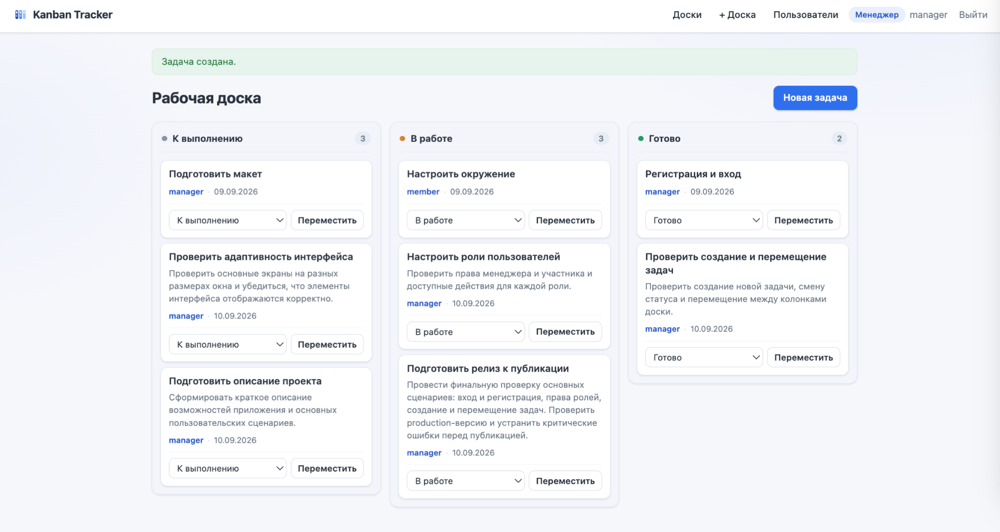
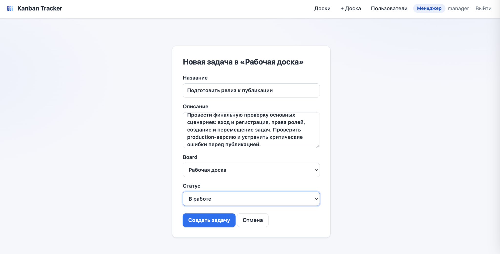
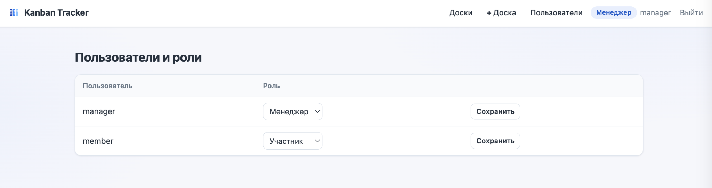

# Kanban Tracker

Веб-инструмент для управления рабочими задачами на Kanban-доске. Пример небольшого внутреннего приложения с авторизацией, ролями пользователей и управлением статусами задач. Такой формат может использоваться как внутренний интерфейс вокруг операционных процессов и работы с данными.

**Живая версия:** https://web-production-a867b.up.railway.app/



## Возможности

- **Доски** — общий список досок; создание доски доступно менеджеру.
- **Задачи** — создание на доске: название, необязательное описание; автор и дата создаются автоматически.
- **Статусы** — «К выполнению», «В работе», «Готово»; счётчик задач в каждой колонке.
- **Перемещение задач** — выбором статуса с кнопкой «Переместить» либо drag-and-drop, без перезагрузки страницы.
- **Авторизация** — регистрация и вход; новый аккаунт получает роль «Участник».
- **Роли и права** — участник перемещает только свои задачи, менеджер — любые.
- **Управление пользователями** — менеджер меняет роли на странице «Пользователи».
- **Django admin** — доски, задачи и профили доступны администратору.
- **Адаптивность** — на узких экранах колонки доски складываются вертикально.

## Роли

**Менеджер**

- создаёт доски;
- перемещает любые задачи на доске;
- изменяет роли пользователей на странице «Пользователи».

**Участник**

- просматривает доски и создаёт задачи;
- перемещает только собственные задачи.

Каждый новый аккаунт по умолчанию — «Участник». Повысить до «Менеджера» может другой менеджер на странице «Пользователи» либо администратор через Django admin.

## Интерфейс

### Создание задачи



### Пользователи и роли



## Стек

Python · Django · PostgreSQL · HTML/CSS · JavaScript · Railway

## Локальный запуск

<details>
<summary>Инструкция по локальному запуску</summary>

```bash
git clone https://github.com/petr-sidorov/tracker-kanban.git
cd tracker-kanban
python3 -m venv .venv
source .venv/bin/activate
pip install -r requirements.txt
python manage.py migrate
python manage.py runserver
```

После запуска приложение доступно по адресу http://127.0.0.1:8000/

</details>

## Развёртывание

Production-версия размещена на Railway, база данных — PostgreSQL.
